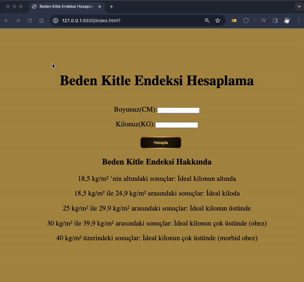

📊 **Beden Kitle Endeksi Hesaplama Aracı**

Bu basit web uygulaması, kullanıcıların boy ve kilo bilgilerini girerek beden kitle endeksini (BMI) hesaplamalarına yardımcı olur. BMI, bir kişinin kilosunun boyuna göre normal, zayıf, kilolu, obez veya aşırı obez olup olmadığını belirlemek için yaygın olarak kullanılan bir ölçümdür.

ℹ️ **Nasıl Kullanılır:**

1. Web sayfasında, kullanıcı boy ve kilo bilgilerini girer.
2. "Hesapla" butonuna tıkladıktan sonra, beden kitle endeksi hesaplanır.
3. Sonuçlar, kullanıcının beden kitle endeksi kategorisini ve bir kilo rehberini gösterir.

🔍 **Kullanılan Teknolojiler:**

- HTML
- CSS
- JavaScript

👨‍💻 **Proje Geliştiricisi:**
Bu projeyi geliştiren kişi [Salih Avcı](https://github.com/avcisalih) tarafından oluşturulmuştur.

🔗 **Proje Ekran Görüntüsü:**

